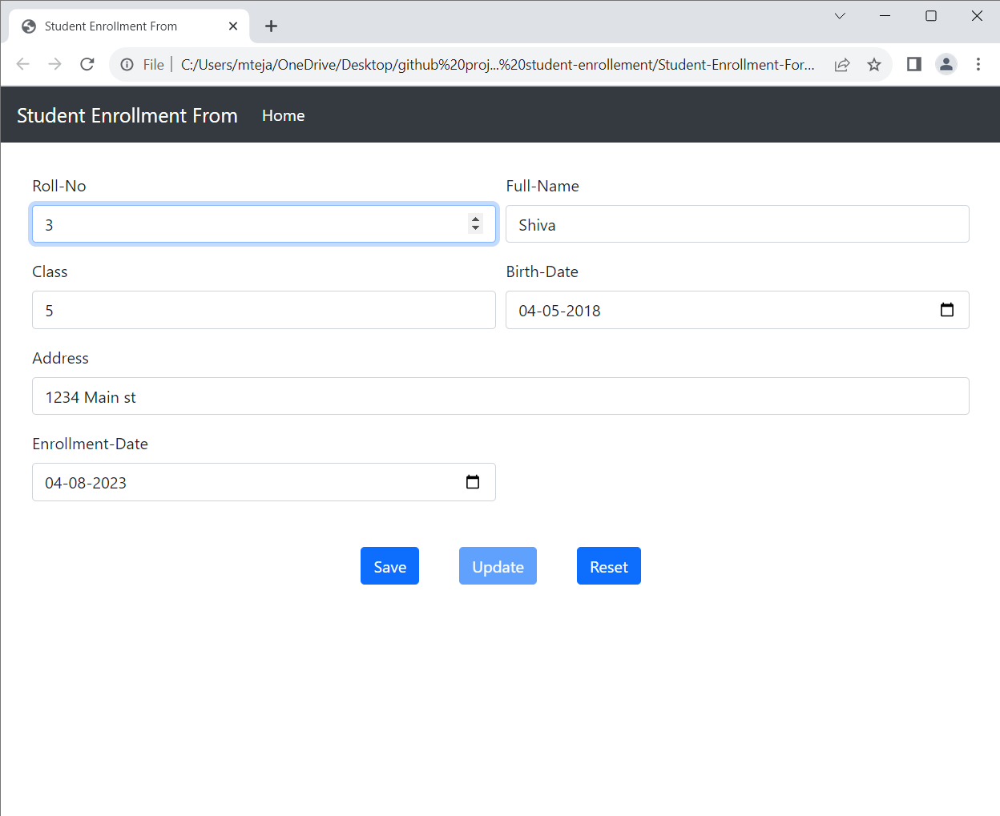

# Benefits of using JsonPowerDB
* Simple to use , real time database
* Simplest way to retrieve data in a JSON format.
* Backends code is not required for database 
* No need for defining schema 
* Querying the database is easy there is no need  of knowledge of SQL commands

# TECH STACK USED
* HTML
* CSS
* JAVASCRIPT 
* JsonPowerDB ( As Database)

# Screenshots:





  ##### Clone the project 
  ```
  git clone https://github.com/prashant-smart/Recommendation-system.git
  ```
  After cloning 
  
  Move to **public_html** and then **script** folder and in **script.js** file replace the **connectionToken** by with your Connection Token
  
  # Sources
  * Introduction to JsonPowerDB - V2.0 course  on https://careers.login2explore.com/
  * [Bootstrap](https://getbootstrap.com/docs/5.0/getting-started/introduction/) 


  --------------------
## Hope You Like the Project ❤️❤️❤️
## Peace to everyone 🙏🏻

